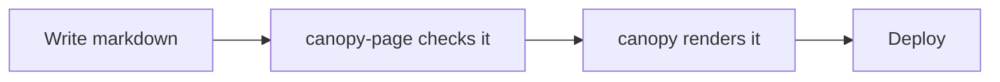

# Diagrams

Canopy renders CommonMark, GFM, math, and highlighted code on its own. Anything past that — a
diagram fence rendered to SVG, say — goes through one fixed extension point: a rehype plugin, run
after canopy sanitizes the page's HTML and before Shiki highlights its code. A site names the
plugin's package in its settings file; the plugin does the rest.

```json
{ "rehypePlugins": ["rehype-declart"] }
```

## declart, rendered at build time

The block below is real input, run through the actual plugin when this page was built — nothing
on this page is a screenshot or a hand-drawn substitute.

```declart
kind = "flow"
title = "Publishing a page"

[[items]]
label = "Write markdown"

[[items]]
label = "canopy-page checks it"

[[items]]
label = "canopy renders it"
emphasis = "primary"

[[items]]
label = "Deploy"
```

[declart](https://github.com/iyulab/declart) takes a diagram description — flow, tier, hierarchy,
matrix, and a handful of other kinds — and renders it to an inline `<svg>` at build time, through
a WebAssembly binding rather than a browser. `rehype-declart` is the rehype plugin that wires that
into a fence: any block whose language is `declart` is claimed, parsed, and replaced before Shiki
ever sees it. Nothing about reading this page depends on a script — the SVG above is as static as
the paragraph around it, the same guarantee [the front page](../../index.md) makes for the rest of
the site.

## mermaid, and why this site does not render it

[Mermaid](https://mermaid.js.org/) is diagrammed in plain text too, and `rehype-mermaid` plugs
into the same extension point the same way declart's plugin does:

```json
{ "rehypePlugins": ["rehype-mermaid"] }
```



That fence is not rendered here — this site's own settings do not name `rehype-mermaid`, so it
gets exactly what any other fence gets: syntax highlighting, and nothing more. `rehype-mermaid`
renders through a real browser (it depends on
[Playwright](https://playwright.dev/)) rather than a small WebAssembly binding, which means a site
that enables it needs a headless Chromium installed wherever it builds. That is a reasonable cost
for a site that wants mermaid specifically, and this site's own settings file could name it the
same way it names `rehype-declart`. It does not, because carrying a browser download through this
site's own build for a second diagram renderer is not a cost this documentation needs to pay to
demonstrate that the extension point works — declart already shows that end to end, with nothing
extra to install.
