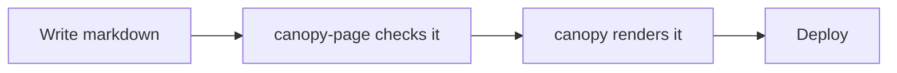

# Diagrams

Canopy renders CommonMark, GFM, math, and highlighted code on its own. Anything past that — a
diagram fence rendered to SVG, say — goes through one fixed extension point: a rehype plugin, run
after canopy sanitizes the page's HTML and before Shiki highlights its code. A site names the
plugin's package in its settings file; the plugin does the rest.

```json
{ "rehypePlugins": ["rehype-declart", "rehype-mermaid"] }
```

## declart, rendered at build time

The block below is real input, run through the actual plugin when this page was built — nothing
on this page is a screenshot or a hand-drawn substitute.

```declart
kind = "flow"
title = "Publishing a page"

[[items]]
label = "Write markdown"

[[items]]
label = "canopy-page checks it"

[[items]]
label = "canopy renders it"
emphasis = "primary"

[[items]]
label = "Deploy"
```

[declart](https://github.com/iyulab/declart) takes a diagram description — flow, tier, hierarchy,
matrix, and a handful of other kinds — and renders it to an inline `<svg>` at build time, through
a WebAssembly binding rather than a browser. `rehype-declart` is the rehype plugin that wires that
into a fence: any block whose language is `declart` is claimed, parsed, and replaced before Shiki
ever sees it. Nothing about reading this page depends on a script — the SVG above is as static as
the paragraph around it, the same guarantee [the front page](../../index.md) makes for the rest of
the site.

## mermaid, rendered the same way

[Mermaid](https://mermaid.js.org/) is diagrammed in plain text too, and `rehype-mermaid` plugs
into the same extension point the same way declart's plugin does — no canopy code cares which
plugin a site names, or how many:



That diagram is as real as declart's: `rehype-mermaid` claims the fence, renders it, and replaces
it before Shiki ever sees a `language-mermaid` block to highlight. The difference is what does the
rendering. declart renders through a WebAssembly binding — no browser involved. `rehype-mermaid`
renders through a real one: it depends on [Playwright](https://playwright.dev/), and a site that
enables it needs a headless Chromium installed wherever it builds. This site's own build now
carries that cost — installing a browser adds real time and disk to every build, which is worth
naming plainly rather than leaving implicit. What it buys back is exactly what the paragraph above
this one claims for the rest of the site: the SVG is generated once, at build time, and reading
this page still depends on nothing but HTML.
